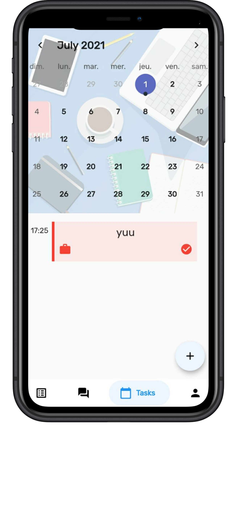
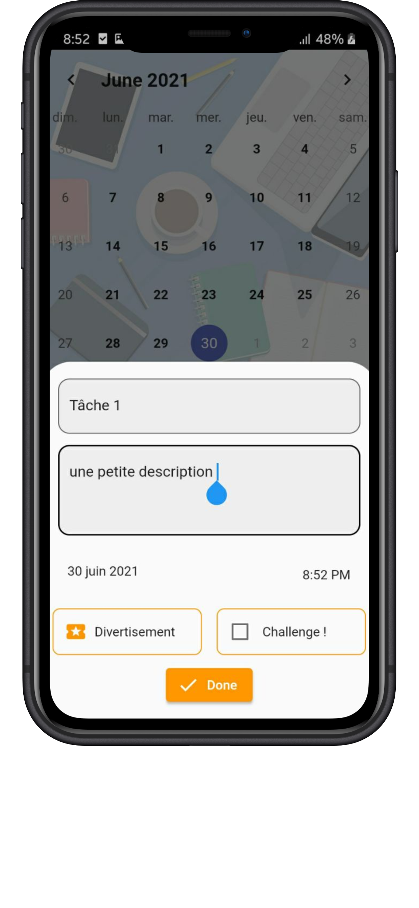
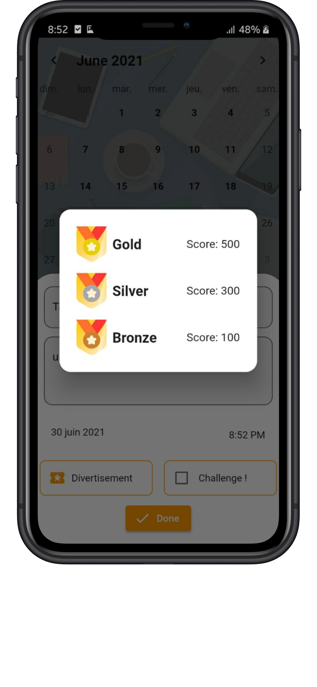
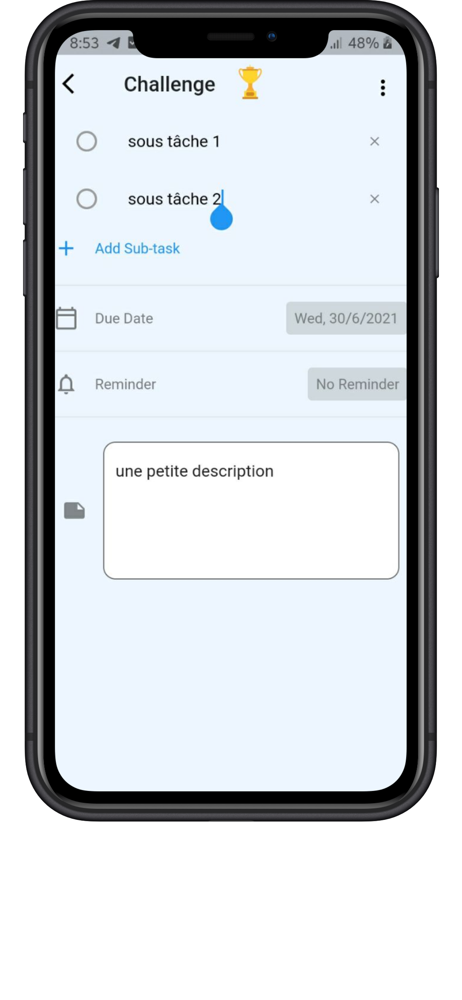
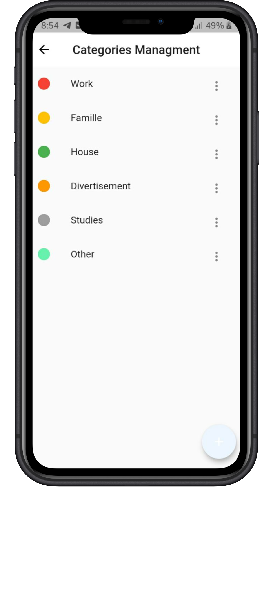
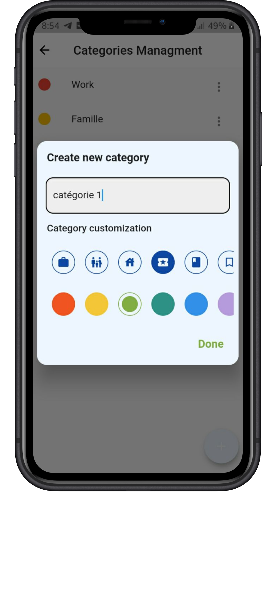
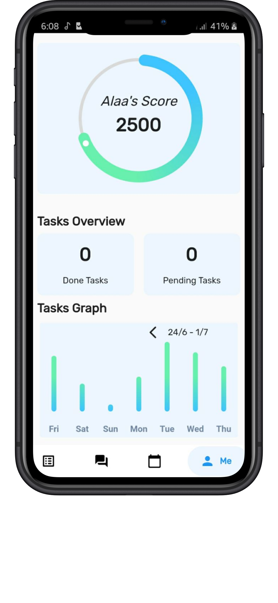
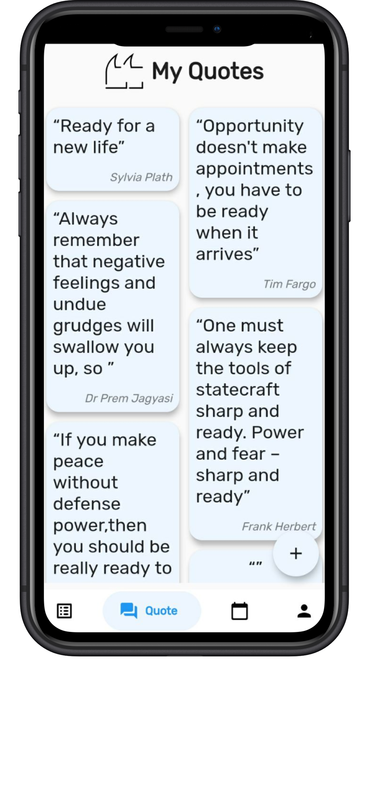

 

<h1 align="center">
 
   
  Mirac, be more productive !
   

  

   

</h1>

<h4 align="center">A flutter time management app as my final year school projet built using <a href="https://flutter.dev" target="_blank">Flutter</a>.</h4>

 

  <a href="#key-features">Key Features</a> •
  <a href="#implementation">Implementation</a> •
  <a href="#who">Who ?</a> •

## Key Features

| Feature                                        | Screenshot                                                   |
| ---------------------------------------------- | ------------------------------------------------------------ |
| Calendar view                                  |  |
| Add a Task                                     |  |
| Pick the level                                 |  |
| Add your sub tasks and pick your reminder time |  |
| Pick your task category                        |  |
| Add your own categories                        |  |
| Check your stats                               |  |
| Add your inspiring quotes                      |  |

## Implementation
- The app saves the data locally using the **moor** package
- It uses **scheduled notifications** as a way to remind you with your unDone tasks
- For the calendar, the beautiful package **Table_calendar** is used
- To remember all the user preferences, the one only **Shared_preferences** is used
- And for the beautiful animations, i must credit [Lottie animations](https://lottiefiles.com/) for their free stuff

 ## Tools used:
* Vs Code (text editor)
* Dart (logic)

## Who:
This project was made by: 
* [Alaa Eddine Aouimeur](https://github.com/AlaaEdAouimeur)

> GitHub [@alaaedaouimeur](https://github.com/alaaedaouimeur)  · 
> Instagram [@x.alaaaouimeur.x](https://www.instagram.com/x.alaaaouimeur.x/)
